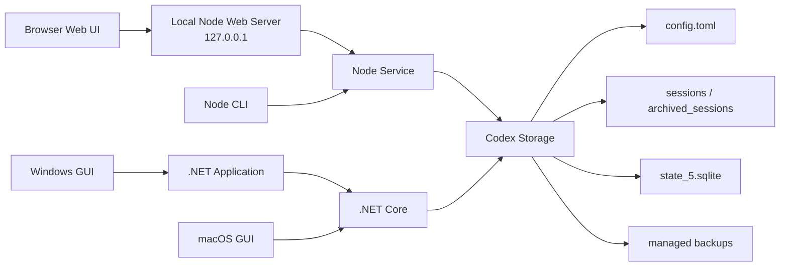

<div align="center">

# codex-provider-sync

### From safe Codex history recovery to cross-device continuity

[](https://github.com/Dailin521/codex-provider-sync/actions/workflows/ci.yml)
[](https://www.npmjs.com/package/@dailin521/codex-provider-sync)
[](https://github.com/Dailin521/codex-provider-sync/releases/latest)
[](../LICENSE)
[](https://linux.do/)

[中文](../README.md) · **English** · [日本語](README_JA.md) · [한국어](README_KO.md)

</div>

## Positioning

`codex-provider-sync` is evolving from a provider metadata synchronizer into a **local-first backup, cross-device continuity, and recovery tool for Codex sessions**.

The current `0.x` release already repairs history visibility after provider changes and provides managed recovery points before writes plus a restore command. These recovery points undo this tool's metadata and SQLite changes; they are not complete chat archives. Complete local backups, portable session bundles, sync folders, and cross-device conflict handling are roadmap items, not shipped capabilities.

Provider synchronization remains a compatibility repair, not the whole product boundary. This project does not compete with provider managers such as CCSwitch: they switch accounts or providers, while this project starts from proven history-visibility recovery and will focus on complete session backups, cross-device continuity, and recovery from failures. See the [product direction (Chinese)](PRODUCT_DIRECTION_ZH.md) for the complete scope and principles.

## What it solves

After switching `model_provider`, older sessions may disappear from Codex Desktop or `/resume`. **The data usually remains on disk**; only the provider information in session files and the SQLite index is out of sync.

This tool synchronizes session files and the SQLite index, restoring session visibility and creating a backup before writing. It does not sign in, switch accounts, or modify `auth.json` or message content.

<p align="center">
  
</p>

### When is synchronization needed?

- **Typical case:** Switching between official OpenAI and a custom relay. Official OpenAI always uses `openai`, so the Provider ID changes and history needs to be synchronized.
- **Existing mixed history:** Older sessions already contain different Provider IDs and need to be aligned with the current provider.
- **No synchronization needed:** Switching only among custom relays that share one Provider ID, or when CCSwitch or another tool has already synchronized history.

## Quick Start

> The Windows GUI and Local Web UI currently use a Simplified Chinese interface.
>
> CLI/Web and the Windows GUI are released independently, so their version numbers may differ.

| Scenario | Recommended interface |
| --- | --- |
| Windows desktop | [Download Windows GUI](https://github.com/Dailin521/codex-provider-sync/releases/latest) · [Usage guide](#windows-gui) |
| macOS desktop | [Local Web UI (CLI required)](#local-web-ui); [native GUI build guide](README_MAC_GUI_EN.md) |
| Browser interface or cross-platform use | [Local Web UI (CLI required)](#local-web-ui) |
| Scripts, CI, or WSL | [CLI](#cli) |

### Windows GUI

Download `CodexProviderSync.exe` from [Releases](https://github.com/Dailin521/codex-provider-sync/releases/latest):

1. Click `刷新` (Refresh).
2. Select the target provider.
3. Click `立即同步` (Sync Now).

The application is not code-signed, so Windows may show a security warning. Download only from this project's Releases.

[Full Windows GUI guide (Chinese)](README_GUI_ZH.md)

### Local Web UI

The Local Web UI is provided by the CLI. Install Node.js `16.20.2+`, then install this project's official npm package and start it:

```bash
npm install -g @dailin521/codex-provider-sync
codex-provider web
```

<p align="center">
  <a href="../images/README/2026-08-05T03-53-48.708Z.png"></a>
</p>

Common options:

```bash
codex-provider web --no-open       # Do not open a browser automatically
codex-provider web --port 8792     # Use a specific port
codex-provider web --reset-access  # Pair a browser again
```

The Web UI listens on `127.0.0.1` by default and opens a browser to pair automatically. Storage paths are managed by the storage configuration (profile) at the top of the page. Write operations require confirmation.

#### Synchronize history after switching providers

1. Switch providers with CCSwitch or your usual tool.
2. Click `读取状态` (Read Status) in the Web UI if needed (optional).
3. Keep `仅同步元数据` (Metadata Only), select the target provider, and confirm the sync.
4. You are done when the page shows `Provider 元数据已对齐` (Provider Metadata Aligned).

> **Note:** Metadata sync restores history visibility only. When continuing an old session across providers, the target backend may be unable to decrypt its `encrypted_content` reasoning data, causing continuation or compaction to fail.

[Full Web UI guide (Chinese)](README_WEB_UI_ZH.md)

### CLI

The CLI supports Node.js `16.20.2+`. After installing Node.js, install this project's official npm package:

```bash
npm install -g @dailin521/codex-provider-sync
codex-provider status
codex-provider sync
```

| Command | Purpose |
| --- | --- |
| `codex-provider status` | Inspect provider, rollout, and SQLite state |
| `codex-provider sync` | Synchronize to the current provider |
| `codex-provider switch <provider-id>` | Switch provider, then synchronize |
| `codex-provider restore <backup-dir>` | Restore a backup |
| `codex-provider watch` | Watch configuration and SQLite changes |

By default, `switch` also updates the root-level `model` when the target provider section defines one. Use `--keep-root-model` to preserve the current value, or `--model <name>` to set it explicitly.

SQLite Home resolution order: `--sqlite-home` → root-level `sqlite_home` in `config.toml` → `CODEX_SQLITE_HOME` → `<Codex Home>/sqlite`. Only the default layout falls back to `<Codex Home>/state_5.sqlite`.

## Current Architecture



- The Web UI and CLI share the same Node service logic.
- The Windows GUI calls .NET Core through the Application layer; the macOS GUI currently calls .NET Core directly.
- The Node service and .NET Core enforce the same configuration, rollout, SQLite, and backup safety boundaries.

This describes the current implementation, not the final target. The CLI/Core will become the single business implementation; the browser UI and a lightweight Windows desktop shell will reuse one React UI and call backup, sync, recovery, and compatibility-repair capabilities through a versioned machine protocol. The Windows package should bundle its runtime so ordinary users do not need to install Node.js.

## Safety boundaries

- Before every `sync` or `switch`, a backup is created at `<Codex Home>/backups_state/provider-sync/<timestamp>`; with the default Codex Home, this is `~/.codex/backups_state/provider-sync/<timestamp>`.
- Does not modify message content, session titles, authentication data, `auth.json`, or `updated_at`.
- If SQLite is in use, close Codex, Codex App, and app-server, then retry.
- If an active session locks rollout files, other files continue; sync again after that session ends.
- When continuing an old session across providers or accounts, the target backend may be unable to decrypt `encrypted_content`, causing continuation or compaction to fail. Return to the original provider/account or start a new session.
- Windows cannot write directly to a WSL UNC SQLite Home; enter WSL and run the CLI with Linux paths.

## Documentation

- [Product direction (Chinese)](PRODUCT_DIRECTION_ZH.md)
- [AI / Agent Guide](../AGENTS.md)
- [Windows GUI guide (Chinese)](README_GUI_ZH.md)
- [Web UI guide (Chinese)](README_WEB_UI_ZH.md)
- [中文](../README.md) · [日本語](README_JA.md) · [한국어](README_KO.md)
- [macOS GUI: 中文](README_MAC_GUI_ZH.md) · [English](README_MAC_GUI_EN.md)
- [How it works (Chinese)](WORKING_PRINCIPLE_ZH.md) · [Changelog](../CHANGELOG.md) · [Contributing](../CONTRIBUTING.md)

## Development

```bash
npm ci
npm run web:build
npm run web:start
npm test
dotnet test desktop/CodexProviderSync.Core.Tests/CodexProviderSync.Core.Tests.csproj
```

Maintainers can publish the CLI/Web package independently of Windows GUI releases. See the [npm publishing guide (Chinese)](NPM_PUBLISHING.md).

## Acknowledgements

Thanks to [@tangquanwei](https://github.com/tangquanwei) for proposing and implementing the Local Web UI, contributing history browsing and the multilingual documentation foundation, and bringing it into v0.5.0 through [PR #80](https://github.com/Dailin521/codex-provider-sync/pull/80), and to everyone who has contributed code, documentation, testing, and investigation.

[Contributor list](../CONTRIBUTORS.md) · [GitHub Contributors](https://github.com/Dailin521/codex-provider-sync/graphs/contributors)

## License

[MIT](../LICENSE)
