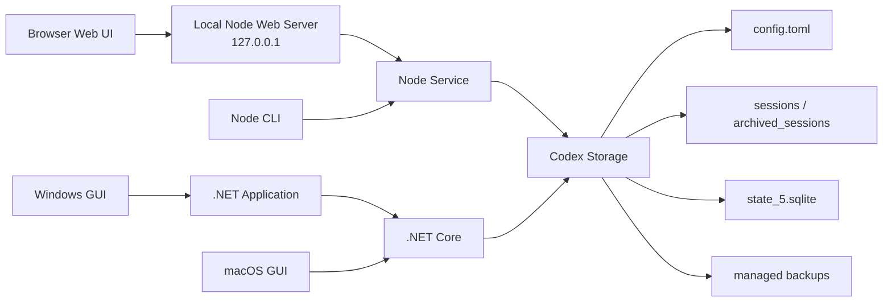

<div align="center">

# codex-provider-sync

### Codex 履歴の安全な復元から、デバイス間の継続利用へ

[](https://github.com/Dailin521/codex-provider-sync/actions/workflows/ci.yml)
[](https://www.npmjs.com/package/@dailin521/codex-provider-sync)
[](https://github.com/Dailin521/codex-provider-sync/releases/latest)
[](../LICENSE)
[](https://linux.do/)

[中文](../README.md) · [English](README_EN.md) · **日本語** · [한국어](README_KO.md)

</div>

## 位置づけ

`codex-provider-sync` は、Provider メタデータ同期ツールから、**ローカルファーストの Codex セッションバックアップ、デバイス間連携、復元ツール**へと発展しています。

現行の `0.x` 版では、Provider 切り替え後の履歴表示の修復に加え、書き込み前の管理対象リカバリーポイントと復元コマンドを提供しています。このリカバリーポイントは本ツールによるメタデータと SQLite の変更を取り消すためのもので、完全なチャットアーカイブではありません。完全なローカルバックアップ、ポータブルなセッションパッケージ、同期フォルダー、デバイス間の競合処理は今後のロードマップであり、現時点の提供機能ではありません。

Provider 同期は互換性修復の一機能として残りますが、製品全体の境界ではありません。本プロジェクトは CCSwitch などの Provider 管理ツールと競合しません。それらがアカウントや Provider を切り替える一方、本プロジェクトは実証済みの履歴表示の復元を出発点として、完全なセッションバックアップ、デバイス間の継続利用、障害からの復元に重点を置きます。範囲と方針については[製品方針（中国語）](PRODUCT_DIRECTION_ZH.md)を参照してください。

## 解決すること

`model_provider` を切り替えた後、既存セッションが Codex Desktop や `/resume` から消えることがあります。**データ自体は通常ディスク上に残っています**。セッションファイルと SQLite インデックス内の Provider 情報だけが同期されていません。

このツールはセッションファイルと SQLite インデックスを同期してセッションの可視性を復元し、書き込み前にバックアップを作成します。ログイン、アカウント切り替え、`auth.json`、メッセージ本文は扱いません。

<p align="center">
  
</p>

### 同期が必要なのはいつですか？

- **通常のケース：**公式 OpenAI とカスタム中継先を切り替える場合。公式 OpenAI は常に `openai` を使用するため Provider ID が変わり、履歴の同期が必要です。
- **既存履歴で ID が混在している場合：**旧セッションに異なる Provider ID が記録されているため、現在の Provider に揃える必要があります。
- **同期が不要なケース：**同じ Provider ID を共有するカスタム中継先だけを切り替える場合、または CCSwitch などがすでに履歴を同期している場合です。

## クイックスタート

> Windows GUI とローカル Web UI の画面表示は現在、簡体字中国語のみです。
>
> CLI/Web と Windows GUI は別々にリリースされるため、バージョン番号が異なる場合があります。

| 利用場面 | 推奨する入口 |
| --- | --- |
| Windows デスクトップ | [Windows GUI をダウンロード](https://github.com/Dailin521/codex-provider-sync/releases/latest)・[使い方](#windows-gui) |
| macOS デスクトップ | [ローカル Web UI（CLI が必要）](#ローカル-web-ui)・[ネイティブ GUI のビルド手順（英語）](README_MAC_GUI_EN.md) |
| ブラウザ UI またはクロスプラットフォーム利用 | [ローカル Web UI（CLI が必要）](#ローカル-web-ui) |
| スクリプト、CI、または WSL | [CLI](#cli) |

### Windows GUI

[Releases](https://github.com/Dailin521/codex-provider-sync/releases/latest) から `CodexProviderSync.exe` をダウンロードします。

1. 「刷新」（Refresh）をクリックします。
2. 対象の Provider を選択します。
3. 「立即同步」（Sync Now）をクリックします。

コード署名は付与していないため、Windows でセキュリティ警告が表示される場合があります。本プロジェクトの Releases からのみダウンロードしてください。

[Windows GUI の詳細（中国語）](README_GUI_ZH.md)

### ローカル Web UI

ローカル Web UI は CLI に含まれています。Node.js `16.20.2+` をインストールし、本プロジェクトの公式 npm パッケージをインストールして起動します。

```bash
npm install -g @dailin521/codex-provider-sync
codex-provider web
```

<p align="center">
  <a href="../images/README/2026-08-05T03-53-48.708Z.png"></a>
</p>

よく使うオプション:

```bash
codex-provider web --no-open       # ブラウザを自動で開かない
codex-provider web --port 8792     # ポートを指定する
codex-provider web --reset-access  # ブラウザを再ペアリングする
```

Web UI はデフォルトで `127.0.0.1` のみで待ち受け、ブラウザを自動で開いてペアリングします。保存先はページ上部の保存設定（Profile）で管理します。書き込み操作には確認が必要です。

#### Provider 切り替え後に履歴を同期する

1. CCSwitch など普段使用しているツールで Provider を切り替えます。
2. 必要に応じて Web UI で「读取状态」（Read Status）をクリックします（省略可）。
3. 「仅同步元数据」（Metadata Only）のまま対象 Provider を選択し、同期の実行を確認します。
4. 「Provider 元数据已对齐」（Provider Metadata Aligned）が表示されれば完了です。

> **注意：** メタデータ同期で復元されるのは履歴の可視性だけです。Provider をまたいで旧セッションを続行すると、切り替え先のバックエンドが `encrypted_content` の推論内容を復号できず、続行や compact に失敗する場合があります。

[Web UI の詳細（中国語）](README_WEB_UI_ZH.md)

### CLI

CLI は Node.js `16.20.2+` をサポートします。Node.js のインストール後、本プロジェクトの公式 npm パッケージをインストールします。

```bash
npm install -g @dailin521/codex-provider-sync
codex-provider status
codex-provider sync
```

| コマンド | 用途 |
| --- | --- |
| `codex-provider status` | Provider、rollout、SQLite の状態を確認する |
| `codex-provider sync` | 現在の Provider に同期する |
| `codex-provider switch <provider-id>` | Provider を切り替えてから同期する |
| `codex-provider restore <backup-dir>` | バックアップを復元する |
| `codex-provider watch` | 設定と SQLite の変更を監視する |

`switch` は、対象 Provider section に `model` が定義されている場合、デフォルトでルートレベルの `model` も更新します。現在の値を保持するには `--keep-root-model`、明示的に指定するには `--model <name>` を使用します。

SQLite Home の解決順序: `--sqlite-home` → `config.toml` ルートの `sqlite_home` → `CODEX_SQLITE_HOME` → `<Codex Home>/sqlite`。デフォルトレイアウトだけが `<Codex Home>/state_5.sqlite` にフォールバックします。

## 現在のアーキテクチャ



- Web UI と CLI は同じ Node サービスロジックを使用します。
- Windows GUI は Application 層を通じて .NET Core を呼び出し、macOS GUI は現在 .NET Core を直接呼び出します。
- Node サービスと .NET Core は同じ設定、rollout、SQLite、バックアップの安全境界を扱います。

これは現在の実装であり、最終的な目標ではありません。今後は CLI/Core を唯一のビジネス実装とし、ブラウザー UI と軽量な Windows デスクトップシェルが同じ React UI を再利用して、バージョン化された機械向けプロトコルからバックアップ、同期、復元、互換性修復を呼び出す構成へ移行します。Windows パッケージには必要なランタイムを同梱し、一般ユーザーが Node.js を別途インストールしなくても使える形を目指します。

## 安全上の境界

- `sync` / `switch` の前に、毎回 `<Codex Home>/backups_state/provider-sync/<timestamp>` へバックアップします。デフォルトの Codex Home では `~/.codex/backups_state/provider-sync/<timestamp>` です。
- メッセージ本文、セッションタイトル、認証情報、`auth.json`、`updated_at` は変更しません。
- SQLite が使用中の場合は、Codex、Codex App、app-server を閉じてから再試行してください。
- アクティブなセッションが rollout をロックしている場合、他のファイルは続行します。セッション終了後にもう一度同期してください。
- Provider またはアカウントをまたいで旧セッションを続行すると、切り替え先のバックエンドが `encrypted_content` を復号できず、続行や compact に失敗する場合があります。その場合は元の Provider／アカウントに戻すか、新しいセッションを開始してください。
- Windows から WSL UNC SQLite Home に直接書き込むことはできません。WSL に入り、Linux パスで CLI を実行してください。

## ドキュメント

- [製品方針（中国語）](PRODUCT_DIRECTION_ZH.md)
- [AI / Agent ガイド](../AGENTS.md)
- [Windows GUI（中国語）](README_GUI_ZH.md)
- [Web UI（中国語）](README_WEB_UI_ZH.md)
- [中文](../README.md) · [English](README_EN.md) · 日本語 · [한국어](README_KO.md)
- [macOS GUI: 中文](README_MAC_GUI_ZH.md) · [English](README_MAC_GUI_EN.md)
- [仕組み（中国語）](WORKING_PRINCIPLE_ZH.md) · [変更履歴](../CHANGELOG.md) · [コントリビューションガイド](../CONTRIBUTING.md)

## 開発

```bash
npm ci
npm run web:build
npm run web:start
npm test
dotnet test desktop/CodexProviderSync.Core.Tests/CodexProviderSync.Core.Tests.csproj
```

メンテナーは、Windows GUI の Release とは独立して CLI/Web パッケージを公開できます。[npm 公開ガイド（中国語）](NPM_PUBLISHING.md)を参照してください。

## 謝辞

ローカル Web UI を提案・実装し、履歴閲覧機能と多言語ドキュメントの基盤を提供するとともに、[PR #80](https://github.com/Dailin521/codex-provider-sync/pull/80) を通じて v0.5.0 に導入した [@tangquanwei](https://github.com/tangquanwei)、そしてコード、ドキュメント、テスト、問題調査に貢献したすべての方に感謝します。

[コントリビューター一覧](../CONTRIBUTORS.md) · [GitHub Contributors](https://github.com/Dailin521/codex-provider-sync/graphs/contributors)

## License

MIT
