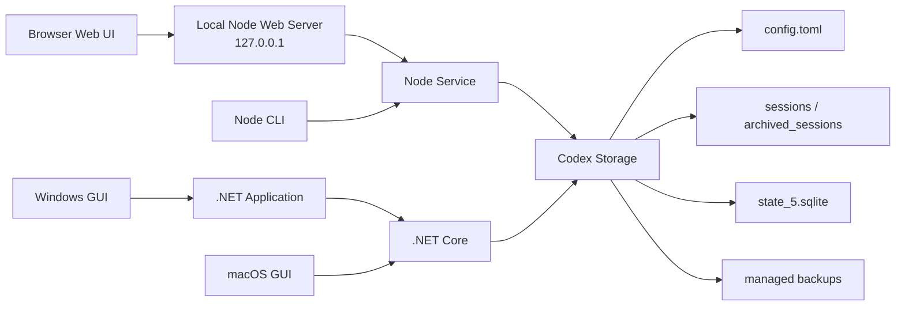

<div align="center">

# codex-provider-sync

### Codex 로컬 세션 진단·복구·백업·마이그레이션 도구

[](https://github.com/Dailin521/codex-provider-sync/actions/workflows/ci.yml)
[](https://www.npmjs.com/package/@dailin521/codex-provider-sync)
[](https://github.com/Dailin521/codex-provider-sync/releases/latest)
[](../LICENSE)
[](https://linux.do/)

[中文](../README.md) · [English](README_EN.md) · [日本語](README_JA.md) · **한국어**

</div>

## 프로젝트 방향

`codex-provider-sync`는 단일 Provider 메타데이터 동기화 도구에서 독립적인 **Codex 로컬 세션 데이터 진단·복구·백업·마이그레이션 도구**로 발전하고 있습니다.

현재 버전은 가장 일반적이고 실제 환경에서 검증된 문제부터 해결합니다. Codex가 실제로 사용하는 로컬 저장소를 찾고 rollout, SQLite, 프로젝트 경로 메타데이터를 진단한 뒤, 먼저 백업을 만들고 Provider 전환으로 사라진 기록 표시를 복구합니다. 이후 기능은 동일한 CLI/Core를 기반으로 저장소 레이아웃, Codex Home, 검증 가능한 백업 마이그레이션까지 단계적으로 확장합니다.

이 프로젝트는 CCSwitch 같은 Provider 관리 도구와 경쟁하지 않습니다. 해당 도구는 계정이나 Provider 전환을 담당하고, 이 프로젝트는 전환 방식과 관계없이 Codex 로컬 세션 데이터를 독립적으로 검사하고 복구합니다. 전체 범위와 원칙은 [제품 방향 문서(중국어)](PRODUCT_DIRECTION_ZH.md)를 참고하세요.

## 해결하는 문제

`model_provider`를 전환하면 이전 세션이 Codex Desktop 또는 `/resume`에서 사라질 수 있습니다. **데이터는 보통 디스크에 그대로 남아 있으며**, 세션 파일과 SQLite 인덱스의 Provider 정보만 동기화되지 않은 상태입니다.

이 도구는 세션 파일과 SQLite 인덱스를 동기화하여 세션 표시를 복원하고, 쓰기 전에 백업을 만듭니다. 로그인이나 계정 전환은 처리하지 않으며 `auth.json`이나 메시지 본문도 수정하지 않습니다.

<p align="center">
  
</p>

### 언제 동기화가 필요한가요?

- **일반적인 경우:** 공식 OpenAI와 사용자 지정 릴레이 사이에서 전환합니다. 공식 OpenAI는 항상 `openai`를 사용하므로 Provider ID가 바뀌며 기록을 동기화해야 합니다.
- **기존 기록에 ID가 섞인 경우:** 이전 세션에 서로 다른 Provider ID가 기록되어 있으므로 현재 Provider에 맞춰야 합니다.
- **동기화가 필요 없는 경우:** 같은 Provider ID를 공유하는 사용자 지정 릴레이 사이에서만 전환하거나 CCSwitch 같은 도구가 이미 기록을 동기화한 경우입니다.

## 빠른 시작

> Windows GUI와 로컬 Web UI의 화면 언어는 현재 중국어 간체만 지원합니다.
>
> CLI/Web과 Windows GUI는 별도로 릴리스되므로 버전 번호가 다를 수 있습니다.

| 상황 | 권장 방법 |
| --- | --- |
| Windows 데스크톱 | [Windows GUI 다운로드](https://github.com/Dailin521/codex-provider-sync/releases/latest) / [사용 방법](#windows-gui) |
| macOS 데스크톱 | [로컬 Web UI (CLI 필요)](#로컬-web-ui) / [네이티브 GUI 빌드 안내 (영문)](README_MAC_GUI_EN.md) |
| 브라우저 UI 또는 크로스 플랫폼 사용 | [로컬 Web UI (CLI 필요)](#로컬-web-ui) |
| 스크립트, CI 또는 WSL | [CLI](#cli) |

### Windows GUI

[Releases](https://github.com/Dailin521/codex-provider-sync/releases/latest)에서 `CodexProviderSync.exe`를 다운로드합니다.

1. `刷新`(새로 고침)을 클릭합니다.
2. 대상 Provider를 선택합니다.
3. `立即同步`(지금 동기화)를 클릭합니다.

프로그램은 코드 서명되지 않았으므로 Windows에서 보안 경고가 표시될 수 있습니다. 이 프로젝트의 Releases에서만 다운로드하세요.

[Windows GUI 전체 안내 (중국어)](README_GUI_ZH.md)

### 로컬 Web UI

로컬 Web UI는 CLI에 포함되어 있습니다. Node.js `16.20.2+`를 설치한 다음 이 프로젝트의 공식 npm 패키지를 설치하고 실행하세요.

```bash
npm install -g @dailin521/codex-provider-sync
codex-provider web
```

<p align="center">
  <a href="../images/README/2026-08-05T03-53-48.708Z.png"></a>
</p>

자주 쓰는 옵션:

```bash
codex-provider web --no-open       # 브라우저를 자동으로 열지 않음
codex-provider web --port 8792     # 포트 지정
codex-provider web --reset-access  # 브라우저 재페어링
```

Web UI는 기본적으로 `127.0.0.1`에서만 수신하며, 브라우저를 자동으로 열어 페어링을 진행합니다. 저장 경로는 페이지 상단의 저장 구성(Profile)에서 관리하며 쓰기 작업에는 확인이 필요합니다.

#### Provider 전환 후 기록 동기화

1. CCSwitch 등 평소 사용하는 도구로 Provider를 전환합니다.
2. 필요한 경우 Web UI에서 `读取状态`(상태 읽기)를 클릭합니다(생략 가능).
3. `仅同步元数据`(메타데이터만 동기화)를 유지한 채 대상 Provider를 선택하고 동기화 실행을 확인합니다.
4. `Provider 元数据已对齐`(Provider 메타데이터 정렬 완료)가 표시되면 완료입니다.

> **주의:** 메타데이터 동기화는 기록의 표시만 복원합니다. Provider를 바꾼 뒤 이전 세션을 계속하면 대상 백엔드가 `encrypted_content`의 추론 내용을 복호화하지 못해 대화 계속 또는 compact가 실패할 수 있습니다.

[Web UI 전체 안내 (중국어)](README_WEB_UI_ZH.md)

### CLI

CLI는 Node.js `16.20.2+`를 지원합니다. Node.js를 설치한 후 이 프로젝트의 공식 npm 패키지를 설치합니다.

```bash
npm install -g @dailin521/codex-provider-sync
codex-provider status
codex-provider sync
```

| 명령 | 용도 |
| --- | --- |
| `codex-provider status` | Provider, rollout, SQLite 상태 확인 |
| `codex-provider sync` | 현재 Provider로 동기화 |
| `codex-provider switch <provider-id>` | Provider 전환 후 동기화 |
| `codex-provider restore <backup-dir>` | 백업 복원 |
| `codex-provider watch` | 설정과 SQLite 변경 감시 |

대상 Provider section에 `model`이 정의되어 있으면 `switch`는 기본적으로 루트 수준의 `model`도 업데이트합니다. 현재 값을 유지하려면 `--keep-root-model`, 명시적으로 지정하려면 `--model <name>`을 사용하세요.

SQLite Home 해석 순서: `--sqlite-home` → `config.toml` 루트의 `sqlite_home` → `CODEX_SQLITE_HOME` → `<Codex Home>/sqlite`. 기본 레이아웃에서만 `<Codex Home>/state_5.sqlite`로 대체합니다.

## 현재 아키텍처



- Web UI와 CLI는 동일한 Node 서비스 로직을 사용합니다.
- Windows GUI는 Application 계층을 통해 .NET Core를 호출하고, macOS GUI는 현재 .NET Core를 직접 호출합니다.
- Node 서비스와 .NET Core는 동일한 설정, rollout, SQLite, 백업 안전 범위를 처리합니다.

이는 현재 구현이며 최종 목표는 아닙니다. 앞으로 CLI/Core를 유일한 비즈니스 구현으로 삼고, Windows UI와 Web UI가 버전이 지정된 기계용 프로토콜을 통해 진단·복구·백업·마이그레이션 기능을 공유하도록 전환합니다.

## 안전 범위

- 매 `sync` / `switch` 전 `<Codex Home>/backups_state/provider-sync/<timestamp>`에 백업합니다. 기본 Codex Home에서는 `~/.codex/backups_state/provider-sync/<timestamp>`입니다.
- 메시지 본문, 세션 제목, 인증 정보, `auth.json`, `updated_at`은 수정하지 않습니다.
- SQLite가 사용 중이면 Codex, Codex App, app-server를 닫은 뒤 다시 시도하세요.
- 활성 세션이 rollout을 잠그면 나머지 파일은 계속 처리합니다. 세션 종료 후 다시 동기화하면 됩니다.
- Provider 또는 계정을 바꾼 뒤 이전 세션을 계속하면 대상 백엔드가 `encrypted_content`를 복호화하지 못해 대화 계속 또는 compact가 실패할 수 있습니다. 이 경우 원래 Provider/계정으로 돌아가거나 새 세션을 시작하세요.
- Windows에서는 WSL UNC SQLite Home에 직접 쓸 수 없습니다. WSL에서 Linux 경로로 CLI를 실행하세요.

## 문서

- [제품 방향 문서 (중국어)](PRODUCT_DIRECTION_ZH.md)
- [AI / Agent 가이드](../AGENTS.md)
- [Windows GUI (중국어)](README_GUI_ZH.md)
- [Web UI (중국어)](README_WEB_UI_ZH.md)
- [中文](../README.md) · [English](README_EN.md) · [日本語](README_JA.md)
- [macOS GUI: 中文](README_MAC_GUI_ZH.md) · [English](README_MAC_GUI_EN.md)
- [작동 원리 (중국어)](WORKING_PRINCIPLE_ZH.md) · [변경 이력](../CHANGELOG.md) · [기여 안내](../CONTRIBUTING.md)

## 개발

```bash
npm ci
npm run web:build
npm run web:start
npm test
dotnet test desktop/CodexProviderSync.Core.Tests/CodexProviderSync.Core.Tests.csproj
```

유지관리자는 Windows GUI Release와 별도로 CLI/Web 패키지를 게시할 수 있습니다. [npm 게시 안내(중국어)](NPM_PUBLISHING.md)를 참조하세요.

## 감사의 말

로컬 Web UI를 제안하고 구현했으며, 채팅 기록 탐색과 다국어 문서의 기반을 기여하고 [PR #80](https://github.com/Dailin521/codex-provider-sync/pull/80)을 통해 v0.5.0에 도입한 [@tangquanwei](https://github.com/tangquanwei), 그리고 코드, 문서, 테스트와 문제 조사에 기여한 모든 분께 감사드립니다.

[기여자 목록](../CONTRIBUTORS.md) · [GitHub Contributors](https://github.com/Dailin521/codex-provider-sync/graphs/contributors)

## License

MIT
